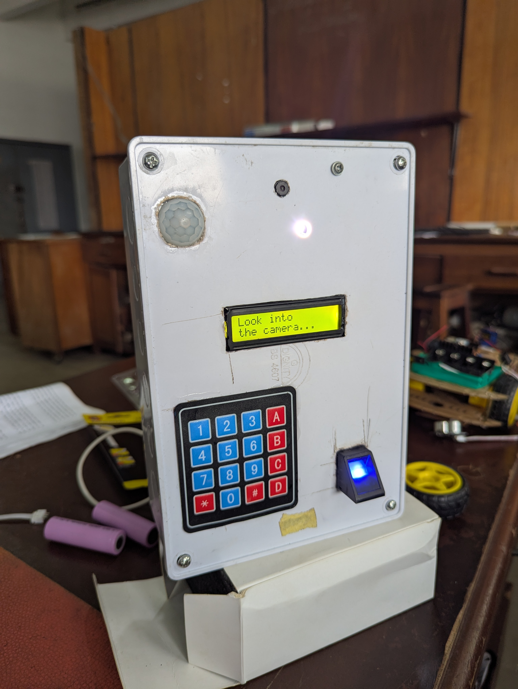

# Internet-Based Dual-MCU Voting System
 
**MCUs:** Arduino Nano + ESP32-CAM  
**Database:** Google Spreadsheet (cloud-based)  

This project is a secure, portable, internet-enabled voting system that combines biometric authentication, CNN-enabled face detection, keypad voting, and online data logging. The system ensures vote integrity, prevents double voting, and allows local administrative control.

<br>

## ✨ Features

- **CNN-Enabled Face Detection** — ESP32-CAM detects voters’ faces before voting process is enabled.
- **Fingerprint Voting Authentication** — Arduino Nano with fingerprint sensor ensures only registered voters' vote can be logged in the database.
- **Internet-Based Connectivity** — ESP32-CAM connects to Wi-Fi for remote admin profile database management and data logging.
- **Online Database Storage** — All profiles and vote records are securely stored in a Google Spreadsheet for live collation.
- **Admin Mode — Voter Enrollment & Deletion** — Manage the voter database.
- **Admin Local Webpage & Streaming** — ESP32-CAM serves a local html webpage for face detection streaming and admin controls.
- **Keypad Party Selection & Reselection** — 4x4 keypad allows selecting or changing the chosen candidate party.
- **Automatic Mode Switching** — Seamless transition between voting mode and admin mode based on opening and closing the html admin webpage.
- **Security Against Double Voting** — The Google web app script blocks re-voting attempts by the same voter.
- **LCD User Feedback** — 16x2 LCD guides users through voting steps and admin voter enrollment by showing system messages.
- **Deep Sleep Mode & PIR Wake** — Saves power when idle; wakes upon human detection via PIR sensor.
- **Battery Powered** — Fully portable and runs on a 3.7V Battery pack.

<br>

## 🛠 Hardware Components
- **Arduino Nano** — LCD, keypad, AS608 fingerprint module, and PIR sensor control.
- **ESP32-CAM** — Face detection, hosted admin webpage with camera streaming, and online data logging.
- **16x2 LCD** — Voter guidance and status messages.
- **4x4 Keypad** — Candidate selection and command input.
- **Fingerprint Sensor** — Voter authentication.
- **PIR Sensor** — Wakes device from deep sleep.
- **Rechargeable Battery** — Portable power supply.

<br>

## 📡 System Workflow
- **Device Booting** — The device boots and initializes all the sensors.
- **Voting Mode** — After booting, it automatically goes into voting mode, waiting for the camera to detect face continually for few seconds.
- **Face Detection** — ESP32-CAM detects voter’s face and voting mode is enabled.
- **Voting Process** — Voter uses keypad to choose candidates, selecting one or no party (000) for each section (Presidential, Gubernatorial, Senatorial). The voter can confirm or select a section to revote.
- **Fingerprint Authentication** — Arduino Nano verifies the registered voter via fingerprint before the vote is logged.
- **Vote Logging** — Data is sent to ESP32-CAM and recorded in a Google Spreadsheet via HTTP.
- **Security Check** — Prevents multiple votes from the same user or from network errors.
- **Idle State** — System enters deep sleep if idle for 60 seconds, until the PIR sensor detects motion.
- **Admin Mode** — If the Admin Webpage is opened at any point, the device automatically switches to Admin Mode and waits for enrollment/delete commands from the webpage.

<br>

## 📂 Repository Structure
```bash
.
├── esp_cam_firmware/      # ESP32-CAM firmware
│   ├── .skip.esp32c3
│   ├── app_httpd.cpp
│   ├── app_httpd.h
│   ├── camera_pins.h
│   ├── esp_cam_firmware.ino
│   ├── voters_html_gz.h
│   ├── voters.html
│   ├── voters.html.gz
│   └── README.md
├── nano_firmware/         # Arduino Nano firmware
│   ├── nano_firmware.ino
│   └── README.md
├── google_web_app_script.txt # Google Apps Script for online logging
├── README.md              # Main project documentation
├── images/
│   ├── Admin_mode.jpg
│   ├── Booting.jpg
│   ├── Circuit.jpg
│   ├── Default.jpg
│   ├── Delete_webpage.png
│   ├── Enroll_webpage.png
│   ├── Enrollment.jpg
│   ├── Fingerprint.jpg
│   ├── Profile_DB_png
│   ├── Vote.jpg
│   ├── Voting_activation.jpg
│   ├── Voting_confirmation.jpg
│   └── Voting_DB.png

```

<br>

## 🚀 Getting Started
1. Flash `nano_firmware` to Arduino Nano.
2. Configure Wi-Fi credentials and Google Spreadsheet API in the `esp32cam_firmware`.
3. Flash `esp32cam_firmware` to ESP32-CAM.
4. Power up and follow LCD and webpage prompts.

<br>


## 📷 Demonstrations
<p align="center">
  
  
</p>

<p align="center">
  
</p>

<br>

## 📜 License
[MIT License](LICENSE)

<br>

## Built by 
**Oladoyin Arewa - [GitHub](https://github.com/Ola-doyin)**

Electronic & Electrical Engineer | AI Engineer | Power Systems Researcher
